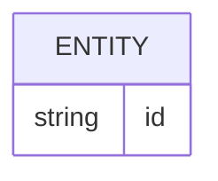

# Banco de dados

<!-- specsfy:documentator:start -->
## Fontes de persistência

| Arquivo |
| --- |
| database/migrations/0001_01_01_000000_create_users_table.php |
| database/migrations/0001_01_01_000001_create_cache_table.php |
| database/migrations/0001_01_01_000002_create_jobs_table.php |
| database/migrations/2026_09_26_000001_add_role_and_status_to_users_table.php |
| database/migrations/2026_09_26_000002_create_projects_tables.php |
| database/migrations/2026_09_27_000001_create_funnels_and_stages_tables.php |
| database/migrations/2026_09_28_000001_create_deals_tables.php |
| Nenhuma estrutura confirmada além das fontes listadas. |

<!-- specsfy:documentator:end -->
